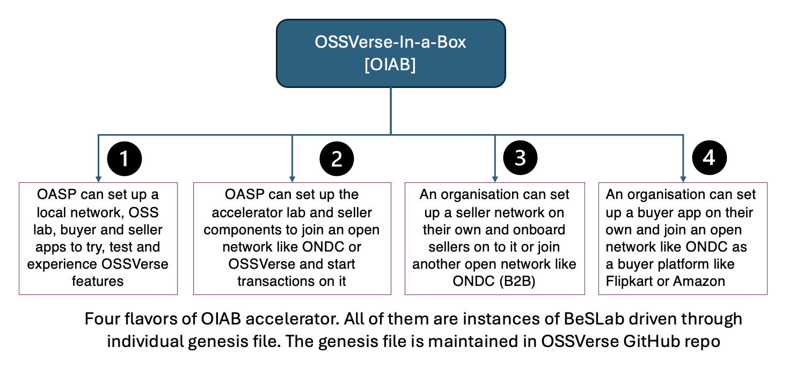

# OSSVerse-In-A-Box (OIAB)

OSSVerse is an open source Marketplace. It is conceptualized as an eco system project comprising of multiple platforms. It is an adaptation of ONDC and Beckn protocol for open source software service delivery . OSSVerse leverages BeSecure(BeS) for delivering open source software security assurance services . OSSVerse aims to establish an open network of OASPs for businesses that will offer trustworthy and reliable open source software assurance services.

The **OSSVerse-In-A-Box (OIAB)** is designed to fast-track participation in the OSSVerse marketplace by providing pre-configured setups and tools. It caters to three distinct user groups, enabling them to efficiently set up networks for software services.

## OSSVerse-In-A-Box (OIAB)
A modular marketplace framework that integrates various components of Beckn protocol implementation. Lets you set up the marketplace quickly for a demo or sandbox environment to test your OSS marketplace transactions.

Key components in the order of forward transaction flow
* Marketplace UI
* Buyer App
* BAP Protocol
* Beckn Gateway
* Beckn Registry
* BPP Network
* BPP Client
* OASP Seller App
* OASP Seller UI

## Architecture
OSSVerse adopts the Beckn open network concept and the protocols to establish the decentralized marketplace. OAIB leverages Beckn-ONIX to set up the key Beckn protocol components required to establish the open network.

## OSSVerse: Streamlining OASP Integration

OSSVerse empowers organizations to leverage the platform with minimal effort. This guide outlines the setup process to seamlessly integrate OASP into your environment. Refer to the provided architecture diagram for a visual representation of the components involved.

### OSSVerse Network Setup:
This configuration enables OASP to connect with the secure and reliable OSSVerse network, facilitating secure protocol calls and secure exchange of security services & transaction data. Notably, OSSVerse utilizes the beckn-enabled protocol.

beckn-onix (Click Here): https://github.com/beckn/beckn-onix (This link directs you to the beckn-onix repository on GitHub for detailed setup instructions.)

### OSSVerse OASP API:
This API streamlines the OASP integration process, enabling functionalities like rapid catalog creation, order management, and more.

oasp-seller-api (Click Here): https://github.com/OSSVerse/oasp-seller-app.git (This link directs you to the oasp-seller-app repository on GitHub for comprehensive setup instructions.)

### OSSVerse OASP UI:
This user interface provides a user-friendly experience for catalog creation and order management within OASP.

oasp-seller-ui (Click Here): https://github.com/OSSVerse/oasp-seller-app-ui.git (This link directs you to the oasp-seller-app-ui repository on GitHub for in-depth setup instructions.)

### Target Groups  

1. **Open AI Security Providers (OASPs)**:  
   Organizations providing OSS/AI security services to the OSSVerse marketplace.  

2. **Organizations Setting Up Seller Networks**:  
   Enterprises wishing to establish their own network for selling software services.  

3. **Organizations Setting Up Buyer Networks**:  
   Entities aiming to create buyer networks similar to platforms like Flipkart or Amazon for software services.  

### Use Cases for OASPs  

#### A. Test Network Setup  

An OASP can set up a test network on their machine that includes:  
- **Buyer Side Components**:
  
  - Buyer UI  
  - Buyer App  
  - BAP (Buyer Protocol) Server  

- **Network Components**:
  
  - Registry  
  - Gateway  

- **Seller Side Components**:
  
  - BPP (Seller Protocol Server)  
  - Seller App  
  - Seller UI  
  - OSS/AI Security Lab Components  

### B. Joining an Existing Network

OASPs can also join an existing network as a seller by setting up only the seller-side components:

- BPP (Seller Protocol Server)  
- Seller App  
- Seller UI  
- OSS/AI Security Lab Components  

## OIAB Setup Driven by BLIman  

The setup for OIAB is managed using **BLIman** with four genesis files to support various use cases:  

1. `OIAB_sandbox_genesis.yaml`  
   - For sandbox setups.  
2. `OIAB_oasp_lab_genesis.yaml`  
   - For OASP labs.  
3. `OIAB_seller_network_genesis.yaml`  
   - For seller networks.  
4. `OIAB_buyer_network_genesis.yaml`  
   - For buyer networks.  

