## <p align=center> Installation of OIAB </p>

Following is the step by step guide to install OSSVerse-In-A-Box in a single machine.

### Components
1. Netwrok Components <br>
    1.1 Registry <br>
    1.2 Gateway <br>
2. Buyer Components <br>
    2.1 Buyer Network Protocol <br>
    2.2 Buyer App <br>
    2.3 Buyer UI <br>
3. Seller Components <br>
    3.1 Seller Netwrok Protocol <br>
    3.2 Seller App and Seller API <br>
    3.3 Seller UI <br>

### Requirements

1. A Linux machine or VM with ubuntu 22.04 installed on it. <br>
2. Recomended hardware for machine is 2 cpu, 8GB RAM and 50 GB storage. <br>
3. Machine should be connected to internet.
4. A domain name to access the OIAB components.

### Steps

1. Install the required tools and settings before installing the OIAB components.

##### Install Docker
Follow the below steps to install docker in your machine.

- ``` # apt update ```
- ``` # apt upgrade -y ```
- ``` # apt install -y ca-certificates curl software-properties-common ```
- ``` # curl -fsSL https://download.docker.com/linux/ubuntu/gpg | sudo apt-key add - ```
- ``` # add-apt-repository -y “deb [arch=arm64] https://download.docker.com/linux/ubuntu focal stable” ```
- ``` # apt update ```
- ``` # apt install -y docker-ce docker-ce-cli containerd.io ```
- ``` # usermod -aG docker $USER ```
- ``` # systemctl restart docker ```

2. Install Nginx
- ``` # apt update ```
- ``` # apt upgrade -y ```

3. Configure Nginx

- ``` touch /etc/nginx/sites-available/registry.<domain name>.com ```

    - Open and add the following text in the file. <br>
    ``` 
    server {
    listen 80;
    listen [::]:80;
    server_name registry.DOMAINNAME.com www.registry.DOMAINNAME.com;

    location / {
        proxy_pass http://0.0.0.0:3030;
        include proxy_params;
    }
    }
    ```
- ``` touch /etc/nginx/sites-available/gateway.<domain name>.com ```

    - Open and add the following text in the file. <br>
    ``` 
    server {
    listen 80;
    listen [::]:80;
    server_name gateway.DOMAINNAME.com www.gateway.DOMAINNAME.com;

    location / {
        proxy_pass http://0.0.0.0:4030;
        include proxy_params;
    }
    }
    ```

    - ``` touch /etc/nginx/sites-available/bapnetwork.<domain name>.com ```

    - Open and add the following text in the file. <br>
    ``` 
    server {
    listen 80;
    listen [::]:80;
    server_name bapnetwork.DOMAINNAME.com www.bapnetwork.DOMAINNAME.com;

    location / {
        proxy_pass http://0.0.0.0:5002;
        include proxy_params;
    }
    }
    ```
    - ``` touch /etc/nginx/sites-available/registry.<domain name>.com ```

    - Open and add the following text in the file. <br>
    ``` 
    server {
    listen 80;
    listen [::]:80;
    server_name bapclient.DOMAINNAME.com www.bapclient.DOMAINNAME.com;

    location / {
        proxy_pass http://0.0.0.0:5001;
        include proxy_params;
    }
    }
    ```

    - ``` touch /etc/nginx/sites-available/byerapi.<domain name>.com ```

    - Open and add the following text in the file. <br>
    ``` 
    server {
    listen 80;
    listen [::]:80;
    server_name buyerapi.DOMAINNAME.com www.buyerapi.DOMAINNAME.com;

    location / {
        proxy_pass http://0.0.0.0:8000;
        include proxy_params;
    }
    }
    ```

    - ``` touch /etc/nginx/sites-available/buyerui.<domain name>.com ```

    - Open and add the following text in the file. <br>
    ``` 
    server {
    listen 80;
    listen [::]:80;
    server_name buyerui.DOMAINNAME.com www.buyerui.DOMAINNAME.com;

    location / {
        proxy_pass http://0.0.0.0:3030;
        include proxy_params;
    }
    }
    ```

- ``` touch /etc/nginx/sites-available/bppnetwork.<domain name>.com ```

    - Open and add the following text in the file. <br>
    ``` 
    server {
    listen 80;
    listen [::]:80;
    server_name bppnetwork.DOMAINNAME.com www.bppnetwork.DOMAINNAME.com;

    location / {
        proxy_pass http://0.0.0.0:6002;
        include proxy_params;
    }
    }
    ```

    - ``` touch /etc/nginx/sites-available/bppclient.<domain name>.com ```

    - Open and add the following text in the file. <br>
    ``` 
    server {
    listen 80;
    listen [::]:80;
    server_name bppclient.DOMAINNAME.com www.bppclient.DOMAINNAME.com;

    location / {
        proxy_pass http://0.0.0.0:6001;
        include proxy_params;
    }
    }
    ```
- ``` touch /etc/nginx/sites-available/registry.<domain name>.com ```

    - Open and add the following text in the file. <br>
    ``` 
    server {
    listen 80;
    listen [::]:80;
    server_name registry.DOMAINNAME.com www.registry.DOMAINNAME.com;

    location / {
        proxy_pass http://0.0.0.0:3030;
        include proxy_params;
    }
    }
    ```
- ``` touch /etc/nginx/sites-available/sellerapi.<domain name>.com ```

    - Open and add the following text in the file. <br>
    ``` 
    server {
    listen 80;
    listen [::]:80;
    server_name sellerapi.DOMAINNAME.com www.sellerapi.DOMAINNAME.com;

    location / {
        proxy_pass http://0.0.0.0:3001;
        include proxy_params;
    }
    }
    ```

    - ``` touch /etc/nginx/sites-available/sellerwenhook.<domain name>.com ```

    - Open and add the following text in the file. <br>
    ``` 
    server {
    listen 80;
    listen [::]:80;
    server_name sellerwebhook.DOMAINNAME.com www.sellerwebhook.DOMAINNAME.com;

    location / {
        proxy_pass http://0.0.0.0:3008;
        include proxy_params;
    }
    }
    ```


    - ``` touch /etc/nginx/sites-available/sellerui.<domain name>.com ```

    - Open and add the following text in the file. <br>
    ``` 
    server {
    listen 80;
    listen [::]:80;
    server_name sellerui.DOMAINNAME.com www.sellerui.DOMAINNAME.com;

    location / {
        proxy_pass http://0.0.0.0:7001;
        include proxy_params;
    }
    }
    ```

- Soft Link all the nginx configurations
```
# ln -s /etc/nginx/sites-available/registry.<domain name>.com /etc/nginx/sites-enabled/registry.<domain name>.com

# ln -s /etc/nginx/sites-available/gateway.<domain name>.com /etc/nginx/sites-enabled/gateway.<domain name>.com

# ln -s /etc/nginx/sites-available/bapnetwork.<domain name>.com /etc/nginx/sites-enabled/bapnetwork.<domain name>.com

# ln -s /etc/nginx/sites-available/bapclient.<domain name>.com /etc/nginx/sites-enabled/bapclient.<domain name>.com

# ln -s /etc/nginx/sites-available/buyerapi.<domain name>.com /etc/nginx/sites-enabled/buyerapi.<domain name>.com

# ln -s /etc/nginx/sites-available/buyerui.<domain name>.com /etc/nginx/sites-enabled/buyerui.<domain name>.com

# ln -s /etc/nginx/sites-available/bppnetwork.<domain name>.com /etc/nginx/sites-enabled/bppnetwork.<domain name>.com

# ln -s /etc/nginx/sites-available/bppclient.<domain name>.com /etc/nginx/sites-enabled/bppclient.<domain name>.com

# ln -s /etc/nginx/sites-available/sellerapi.<domain name>.com /etc/nginx/sites-enabled/sellerapi.<domain name>.com
# ln -s /etc/nginx/sites-available/sellerwebhook.<domain name>.com /etc/nginx/sites-enabled/sellerwebhook.<domain name>.com

# ln -s /etc/nginx/sites-available/sellerui.<domain name>.com /etc/nginx/sites-enabled/sellerui.<domain name>.com

```

- Restart nginx
```
# systemctl restart nginx
```

### <p align=center> Installtion </p>
#### Network Installation
Network is the backbone for the Ossverse and contains the crucial components registry and gateway.

1. Login to the Linux Machine as sudo.
2. Execute
```
# apt update
# apt upgrade
# cd /opt
# git clone https://github.com/beckn/beckn-onix.git
# cd /opt/beckn-onix/install
# ./beckn-onix.sh
```

3. Following screen appears:
```
Beckn-ONIX is a platform that helps you quickly launch and configure beckn-enabled networks.

What would you like to do?
1. Join an existing network
2. Create new production network
3. Set up a network on your local machine
4. Merge multiple networks
5. Configure Existing Network
(Press Ctrl+C to exit)
Enter your choice:

```

4. Enter 2. <br>
Follwing appears:
```
   Which platform would you like to set up?
1. Registry
2. Gateway
3. BAP
4. BPP
Enter your choice:

```
5. Enter 1
When asked for URL as below
```
Proceeding with the setup for Registry...
Enter publicly accessible registry URL:
```
6. Enter the registry url i.e http://registry.DOMAINNAME.com

7. Once script is excuted fully. Do
```
# cd /apt/beckn-onix/install
# ./beckn-onix.sh

What would you like to do?
1. Join an existing network
2. Create new production network
3. Set up a network on your local machine
4. Merge multiple networks
5. Configure Existing Network
(Press Ctrl+C to exit)
Enter your choice:
```
8. Enter 1
```
Which platform would you like to set up?
1. Gateway
2. BAP
3. BPP
```

9. Enter 1
```
Proceeding with the setup for Gateway...
Enter your registry URL:
```

10. Enter the registry URL i.e http://registry.DOMAINNAME.com

11. Check the registry and gateway containers are UP.
```
# docker ps -a
```

12. Open the registry UI in a browser using URL http://registry.DOMAINNAME.com

13. Login using root/root.

14. Click on Beckn tab as shown and select Network Domain in drob down. 
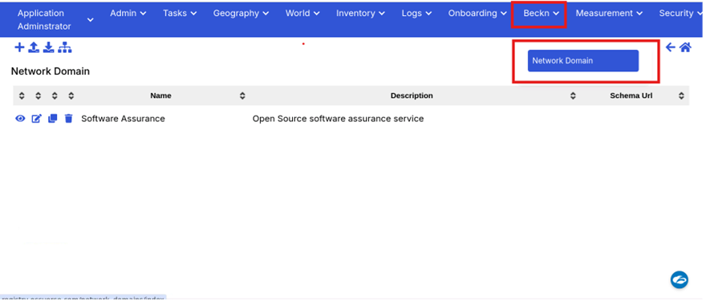

15. Click on "+". 
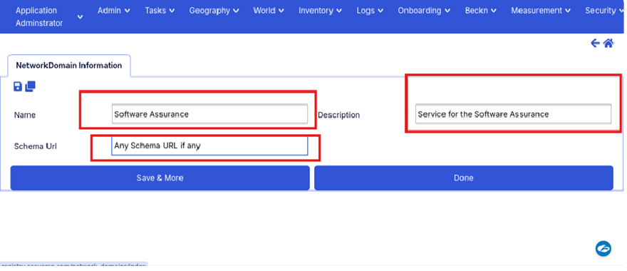
16. Fill the above details and press done.
17. Click on Admin Tab and select "Network Participants" from drop down.


18. Click on edit button as shown
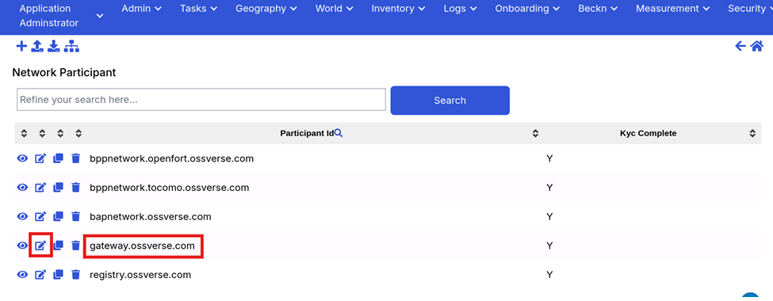

19. Select Netwrok Role and click on Edit as shown.
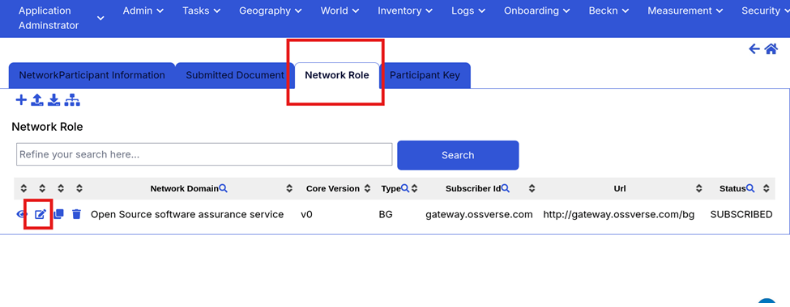

20. Change the status from INITIATED to SUBSCRIBED as shown.
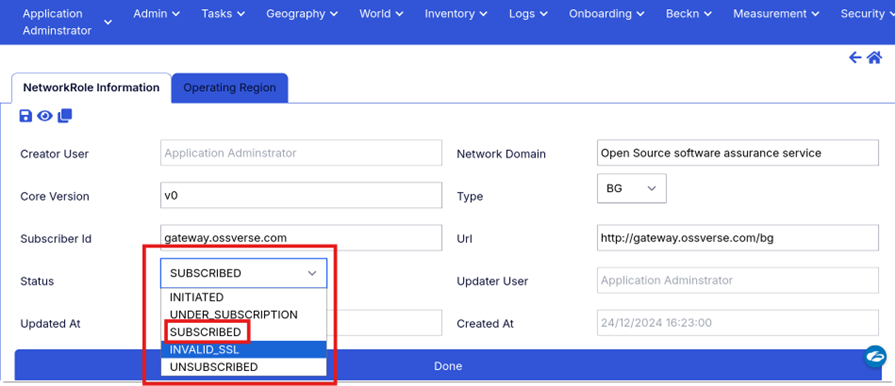

21. In "Netwrok Domain" field enter "*" and select the Network Domain appeared in drop down as shown.
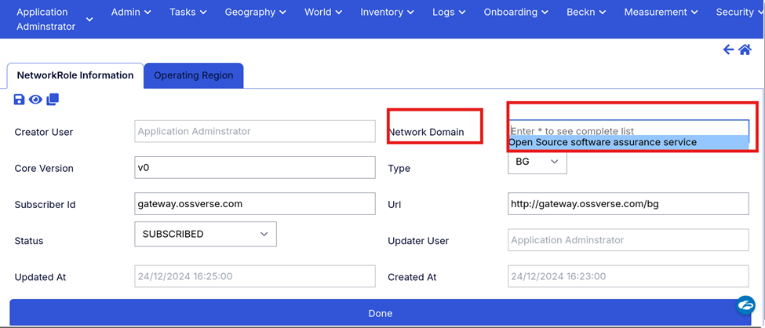

22. Click Done and Save.

Network Compnents are Setup.


### Buyer Components Installation

1. Execute
```
# cd /opt/beckn-onix/install
# ./beckn-onix.sh

Beckn-ONIX is a platform that helps you quickly launch and configure beckn-enabled networks.

What would you like to do?
1. Join an existing network
2. Create new production network
3. Set up a network on your local machine
4. Merge multiple networks
5. Configure Existing Network
(Press Ctrl+C to exit)
Enter your choice:

```
2. Enter 1.
```
Which platform would you like to set up?
1. Gateway
2. BAP
3. BPP
Enter your choice:
```

3. Enter 2
```
Proceeding with the setup for BAP...
................Installing Protocol Server for BAP................
Enter BAP Subscriber ID:
```

4. Enter BAP suscriber ID. Can be any unique string. Usually BAP Network url is used. e.g bapnetwork.DOMAINNAME.com

```
Enter the BAP Network URL:
```

5. Enter the BAP Netwrok URL e.g http://bapnetwork.DOMAINNAME.com
```
Enter your registry URL:
```

6. Enter the registry URL with subscribers appended to it. e.g http://registry.DOMAINNAME.com/subscribers

7. Confirm that the BAP network and client installed sucessfully and docker cotainers are running using
```
#docker ps -a
```
8. On completion of script Change the Network Participant Status from INITIATED to SUBSCRIBED in registry as shown in steps 12 to 22 in section Netwotk Installation above. 

9. Update the Layer 2 for BAP Network and BAP Client as follows:
```
# cd /opt/beckn-onix/layer2/samples/

# docker cp retail_1.1.0.yaml bap-client:/usr/src/app/schemas/Software\ Assurance_1.1.0.yaml

# docker cp retail_1.1.0.yaml bap-network:/usr/src/app/schemas/Software\ Assurance_1.1.0.yaml

# docker restart bap-network bap-client
```

10. Install buyer api
```
# cd /apt
# git clone https://github.com/OSSVerse/OSSverse-buyer-app.git
# cd /opt/ ossverse-buyer-app
# vi .env.default
```
11. Edit following fields
```
i.	PROTOCOLO_SERVER_URL: <Enter the BAP client URL here>
ii.	BAP_ID: <Enter the BAP ID we provided during installation>
iii.	BAP_URL: <Enter the BAP Network URL>
```

12. Update the Docker Compose
```
# vi  docker-compose.yaml
```

13. Change the PORT number for Mongo DB from 27017:27017 to 27018:27017

14. Bring up the docker
```
# docker compose up –build -d
```

15. Check the containers are UP and running using 
```
# docker ps -a
```

16. Bring up the docker compose
```
# docker compose up –build -d
```

17. Install Buer UI
```
# cd /opt
# git clone https://github.com/OSSVerse/ossverse-buyer-app-ui.git
# cd ossverse-buyer-app-ui
# vi Dockerfile
```

18. Change the Node Image version to 20.11.1.
19. Execute
```
# docker build -y buyerappui .
# docker run -d –name buyerappui -p 7000:80 buyerappui
```

#### Install Seller Components

1. Got to Beck folder and execute
```
# cd /opt/beckn-onix/install
# ./beckn-onix.sh

Beckn-ONIX is a platform that helps you quickly launch and configure beckn-enabled networks.

What would you like to do?
1. Join an existing network
2. Create new production network
3. Set up a network on your local machine
4. Merge multiple networks
5. Configure Existing Network
(Press Ctrl+C to exit)
Enter your choice

```

2. Enter 1
```
Which platform would you like to set up?
1. Gateway
2. BAP
3. BPP
Enter your choice:
```

3. Enter 3.
```
Proceeding with the setup for BPP...
................Installing Protocol Server for BPP................
Enter BPP Subscriber ID:
```

4. Enter the BPP subscriber ID. can be any unique string. Uslally BPP network url used for this. e.g bppnetwork.DOMAINNAME.com

```
Enter BPP Subscriber URL:
```

5. Enter the URL for bpp network. e.g http://bppnetwork.DOMAINNAME.com

```
Enter the Registry URL:
```

6. Enter the registry URL e.g http://registry.DOMAINNAME.com/subscribers

```
Enter the Webhook URL:
```

7. Enter the webhook URL appended with "api/vi/client/handler" e.g http://sellerwebhook.DOMAINNAME.com/api/v1/client/handler

8. After complete execution of script, verify that the bpp-network and bpp-client containers are UP and running.
```
# docker ps -a
```

9. Change the Network Participant Status from INITIATED to SUBSCRIBED in registgry by following steps from 12 - 22 in Network Installation section above. Update the status and Network domain for bapnetwork.DOMAINNAME.com network pariticipant.

10. Setup the layer 2 for BPP Network and BPP client as below.
```
# cd /opt/beckn-onix/layer2/samples/

# docker cp retail_1.1.0.yaml bpp-client:/usr/src/app/schemas/Software\ Assurance_1.1.0.yaml

# docker cp retail_1.1.0.yaml bpp-network:/usr/src/app/schemas/Software\ Assurance_1.1.0.yaml

# docker restart bpp-client bpp-network
```

11. Install Seller API
```
# cd /apt
# git clone https://github.com/OSSVerse/oasp-seller-app.git
# cd /opt/ oasp-seller-app
# vi ./seller/.env
```

12. Change following:
```
OPENFORT_SELLER_URL: <Enter the BPP api URL here e.g api.<domain name>.com >
```

13. Whitelist the api URL
```
# vi seller/app/config/environments/base/env.cors.js
```

Change the following
```
‘whitelistUrls’ : [
    'Already exitisting URL',
    'already existing URL',
    'http://sellerapi.DOMAINNAME.com'
]
```

14. Open and change following configurations
```
# vi seller-app-api/lib/config/production_env_config.json
```
Whitelist the CORS url for sellerapi
```
“cors”: {
    “whitelistUrls: [
   "Already existing URL",
   "Already existing URL",
   “http://sellerapi.<domain name>.com”
]
}
```
Also change BPP ID and BPP URL
```
“sellerConfig”: {
	“BPP_ID”: <BPP ID entered while installing”
    “BPP URL”: <BPP Client URL mapped e.g bppclient.<domain name>.com >
} 

```
15. Save and exit

16. Open 
```
# vi ./seller/.env
```

17. Change follwing to point to sellerapi URL e.g http://api.DOMAINNANME.com 

```
OPENFORT_SELLER_APP
```

18. Bring UP the containers
```
# docker-compose up –build -d
```
19. Verify that all the database and seller app containers are UP.

20. Check the sellerapi url is accesible using swagger. Enger the following URL in browser and verify to access the APIs.

```
http://sellerapi.DOMAINNAME.com/api-docs/
```

21. Install Seller UI
```
# cd /opt
# git clone https://github.com/OSSVerse/oasp-seller-app-ui.git
# cd oasp-seller-app-ui
# vi Dockerfile
```

22. Change the node image version to 20.11.1. Also change the following variable to point to sellerapi URL and append "api/v1" at the end of URL. e.g http://sellerapi.DOMAINNAME.COM/api/v1

```
ENV VITE_API_BASE_URL: <Enter the seller api URL with "api/v1" appended to it at last.>
```

23. 
```
# cp example.env .env
```

24. Bring UP containers
```
# docker build -y sellerui .
# docker run -d –name sellerui -p 7001:80 sellerui
```

25. Verify that the Seller UI container is UP and running using 
```
docker ps -a
```
Also, verify that the Seller UI is accessible at http://sellerui.DOMAINNAME.com

26. Create the Organisation and Products in seller app by following below steps:

    1. Open the seller api swagger using the URL
    ```
    http://sellerapi.DOMAINNAME.com/api-docs/
    ```

    2. Expand the POST method of OASP-APIS->Authentication api as shown.
    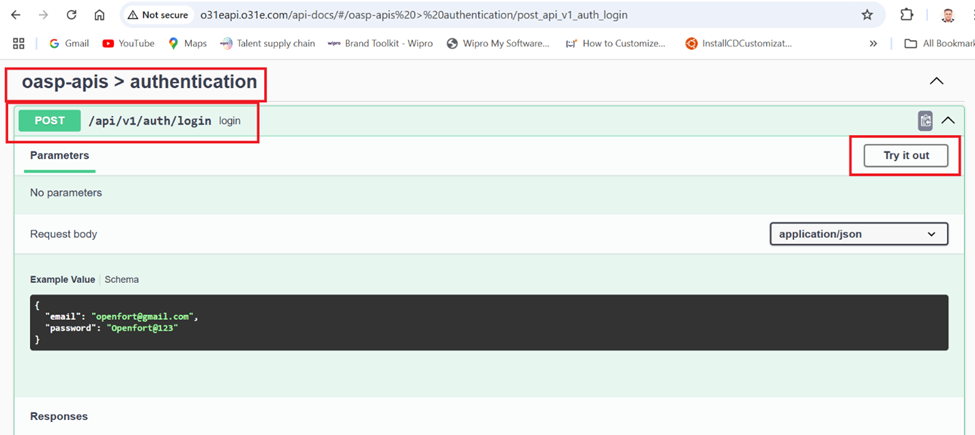

    3. Click "Try it out" and change the body as follows:

    ```
     {
        “email”: “sa@mailinator.com”,
        “password”: “Super@123” 
     }
    ```

    4. Click on execute.
    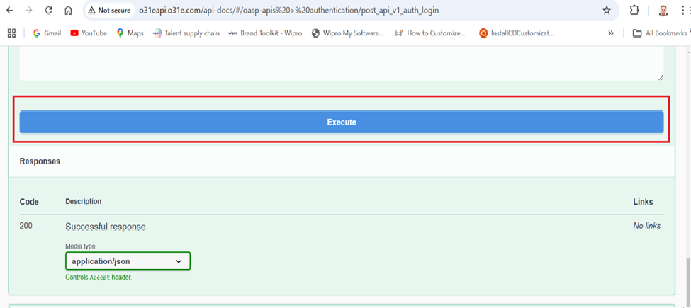

    5. Copy the access token received as a response from above request. Refer below.
    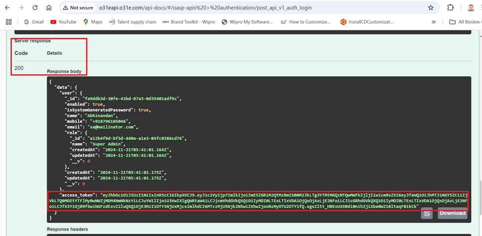

    6. Add new organisation by executing POST method for oasp-api->Organisation api.
    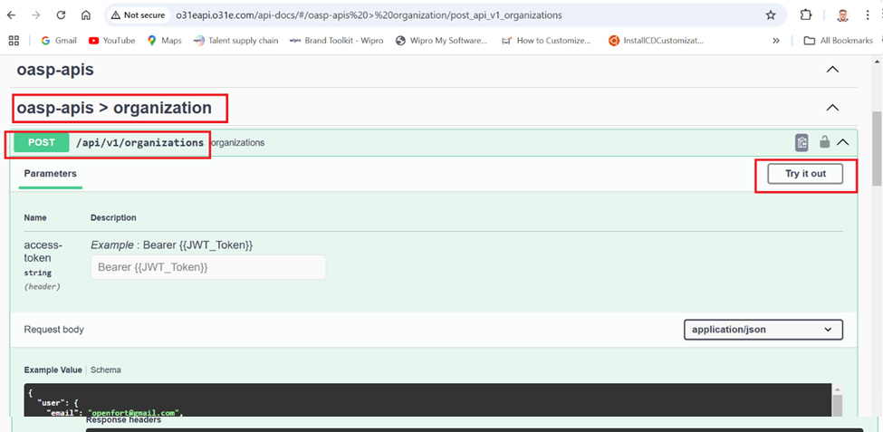

    7. Click on "Try it out". Paste the access token copied above into "access-token" field as shown. Do not remove the Bearer key. 

    Also update the Organisation details in the body such as Organisation Name, Password , email etc. as shown below.

    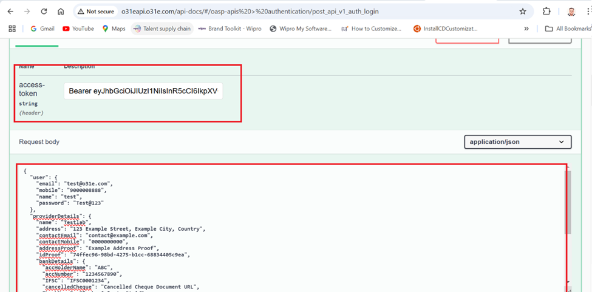

    8. Click Excute and verify response is 200 OK.

    9. Add products

    10. Login and get the access tocken by repeating steps 1 -5 above by using new oganisation email password in the body.

    11. Open the POST methid of oasp->products api and click on execute as done above.

    12. Click on "Try it out" and enter the access token obtained in step 10 above.

    13. Update the product details in product body and click on execute button.
    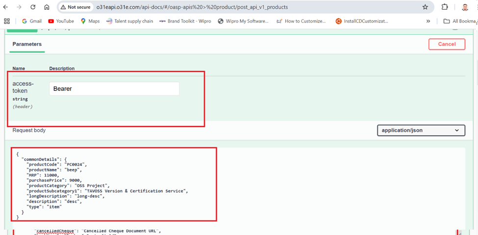

    14. Verify 200 OK as response.

    15. Check the product is listed by GET method for oasp-api->products api. Use the new organisation in body to list all products from the organisation and remove any specific search criterion from body.

    16. Verify the product is listed in response body in GET request.

